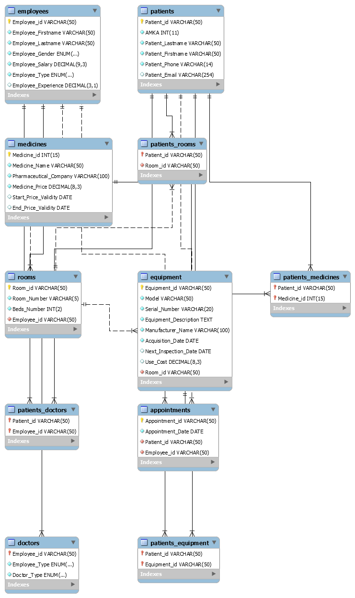

# Hospital Database
A hospital database designed in MySQL step-by-step following the 3.5 Normal Form (BCNF) as part of my 6th semester Database Systems Design course project.

The report.pdf provides a comprehensive analysis of the database normalization procedure. Additionally, scripts are included for populating the database and executing some queries. A small portion of the original data (originally 130MB) is also included.

### Schema:

